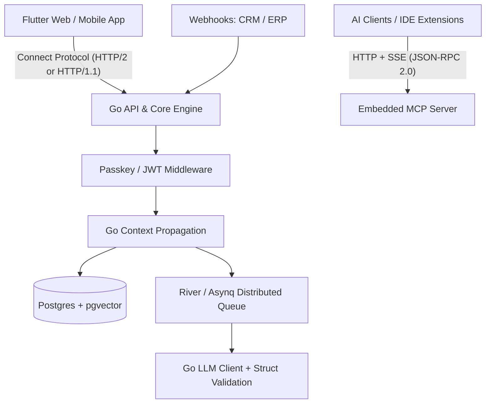

# Truss

A B2B project management and orchestration plaform for an AI interactive workspace.

Truss bridges the gap between fragmented customer systems (CRMs), delivery lifecycles, financial data (ERPs), and unstructured human thoughts. It transforms traditional project management from a manual bookkeeping chore into an automated, network of events.

Engineers and delivery teams hate legacy project management software because of administrative friction—clicking through countless nested menus, manual state tracking, and documentation scattered across disparate platforms.

Truss removes this friction using a specialized, polyglot architecture built for 2026 workflows:

    Zero-Friction Ingestion: Jot down an unstructured sentence anywhere (IDE, terminal, webhook) and let semantic mapping handle the configuration.

    Contextual Knowledge: Guides, documentation, and technical constraints are linked automatically to ongoing tasks via vector embeddings.

    AI-Native Accessibility: An internal Model Context Protocol (MCP) server exposes the system tools directly to LLMs, code assistants, and orchestration agents.

------

Truss utilizes a monorepo layout where the system core is governed by protocol buffer definitions, enforcing compile-time type boundaries across the entire stack.

Truss communicates via Connect, a lightweight alternative to traditional gRPC plumbing:

    On Mobile: Flutter consumes a highly efficient, native binary gRPC chunk stream.

    On Web Browsers: Connect automatically downgrades the stream to Server-Sent Events (SSE) over standard HTTP/1.1 or HTTP/2, bypassing native browser limitations regarding HTTP/2 trailers. Real-time telemetry updates work out-of-the-box without extra infrastructure.

----
